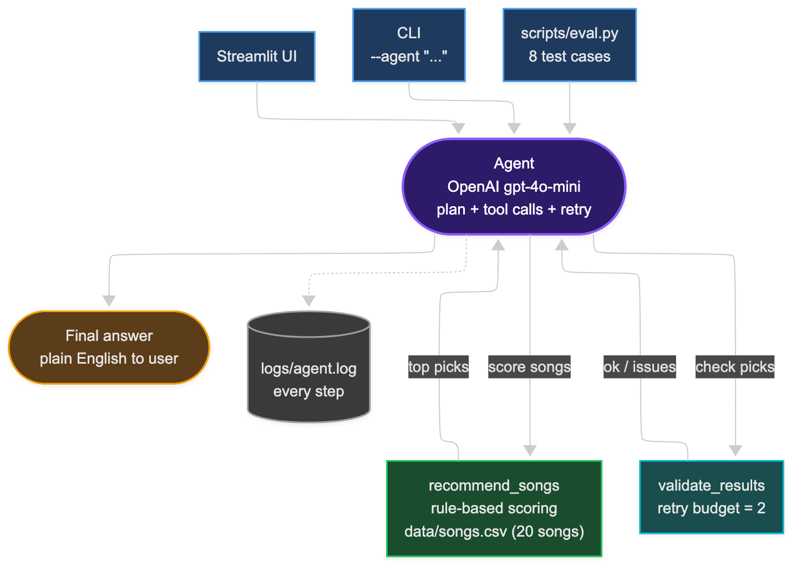

# Music Recommender with an Agent on Top

This is my final project for the Codepath Applied AI module. I took my Music Recommender from earlier modules and built an AI agent on top of it that can take natural language requests and pick songs from the catalog.

Why it matters to me: recommendation is a small enough problem that I can actually see what the AI is doing, but big enough to feel real. Adding an agent let me see how a planning loop changes the experience compared to just clicking sliders.

## Original project (from modules 1-3)

The original project is the **Music Recommender Simulation**. It's a content-based song scoring system. You give it a taste profile (favorite genre, mood, energy level, etc.) and it scores 20 songs from a CSV catalog and returns the top matches with a short explanation for each pick. It also has multiple ranking modes and a diversity penalty to avoid repeating the same artist.

## What I added for this final

I built an agent layer using OpenAI `gpt-4o-mini` with tool calling. The agent does this for every request:

1. Reads the user's natural language message.
2. Pulls out taste preferences and hard constraints (like "no acoustic", "low energy").
3. Calls the existing `recommend_songs` function as a tool.
4. Calls a second tool, `validate_results`, that checks the picks against what the user actually asked for.
5. If validation fails, adjusts the preferences and retries, up to 2 times.
6. Writes a final friendly answer in plain English.

The original rule-based recommender is untouched. The agent just sits on top.

## Architecture overview



User input flows into the agent. The agent plans, calls `recommend_songs` (which uses the original scoring code in `src/recommender.py`), then calls `validate_results` to check the picks. If something is off, it loops back and tries again with adjusted parameters. Every step is logged to `logs/agent.log` so I can see exactly what the agent did. There is also a Streamlit UI and a CLI runner that both use the same agent code.

## Setup

```bash
python -m venv .venv
source .venv/bin/activate
pip install -r requirements.txt
```

Add your OpenAI key:

```bash
cp .env.example .env
# open .env and paste your real key
```

## How to run

Original demo with three preset profiles (no agent, no API key needed):

```bash
python -m src.main
```

Agent from the command line:

```bash
python -m src.main --agent "I want chill study music, no acoustic"
```

Streamlit app (manual tab + agent tab):

```bash
streamlit run app.py
```

Tests:

```bash
pytest
```

Evaluation harness:

```bash
python -m scripts.eval
```

## Sample interactions with the agent

### 1. Pop workout music
Input: `I want pop workout music, high energy`

Top picks the agent returned:
- Late Night Flex by D. Ramos (hip-hop)
- Gym Hero by Max Pulse (pop)
- Storm Runner by Voltline (rock)
- Bassline Fury by PRYZM (edm)
- Iron Tide by Shattered Sun (metal)

Validation passed on the first try. Final answer pumped these as workout tracks.

### 2. Lofi study music
Input: `give me lofi study music`

The agent picked lofi and ambient songs (Library Rain, Midnight Coding, Spacewalk Thoughts). Validation passed first try. Confidence 1.0.

### 3. Chill, no acoustic (the interesting case)
Input: `chill music but no acoustic stuff`

This one is hard. Most chill songs in my catalog are acoustic. The agent tried twice, validation failed both times, then it hit the retry budget. Instead of pretending, it wrote a final answer that admitted the catalog can't fully satisfy and showed the closest non-acoustic options anyway. This is exactly why I added the retry budget.

## Design decisions

- **Why an agent instead of RAG.** I already had a working scorer. Adding RAG would mean bringing in a new data source. Adding an agent gave me natural language input, planning, and a place to add validation, without rewriting the scoring math.
- **Why a separate `validate_results` tool.** I wanted the agent to actually check its own work. Putting the check inside `recommend_songs` would just be a filter. Making it a separate tool forces the agent to reason about whether the output really answers the question.
- **Retry budget of 2.** My first version looped forever when the catalog couldn't satisfy a request. A small budget plus a "best effort" mode lets it give up gracefully and be honest.
- **Hard filter for acoustic.** The original recommender only adds a bonus when the user likes acoustic. It does not penalize acoustic when the user dislikes it. So I added an `exclude_acoustic` filter applied after scoring.
- **Logging to a file.** Every plan step, tool call, observation, retry, and final answer goes to `logs/agent.log` with timestamps. That made debugging the retry loop way easier and gives me something to point at when explaining the system.

## Testing summary

- 10 pytest tests on the underlying recommender pass (genre match, sorting, diversity, scoring, etc.).
- The eval harness `scripts/eval.py` runs 8 natural language cases. On my last run, 5/8 passed with average confidence 0.89.
- The fails were honest fails about the catalog, not the agent itself. The "acoustic folk" case fails because there is only 1 folk and 1 country song. The "no acoustic chill" case fails because almost every chill song is acoustic. Bigger catalog would fix both.

## Reflection

The biggest lesson was that an agent is only as good as the data underneath it. The agent code worked fine. Most fails came from the catalog being small and unbalanced. If a user asks for "intense rock" and there is only one rock song, the agent has nothing good to give. It made me realize how much real recommender teams must care about data balance and not just the algorithm.

Building the retry loop was the part where I felt most like an engineer instead of someone calling an API. My first version just looped forever. Adding a retry budget plus a "give up honestly" path felt like real product thinking.

The validation tool was the surprise for me. Without it, the agent confidently recommended acoustic songs to someone who said "no acoustic". With it, the agent at least tries to fix the mismatch and admits when it can't. Same model, same prompt, very different output.

## Limits and risks

- Catalog is only 20 songs. Some genres have only one song each.
- The agent depends on OpenAI's API. If the key is missing or the network fails, the agent returns a friendly error instead of crashing.
- No defense against prompt injection in the user message yet.
- Costs are tiny but real. Each agent run does between 1 and 7 LLM calls on `gpt-4o-mini`.

## Model card and reflection

See [model_card.md](model_card.md) for the full reflection on bias, misuse, what surprised me, and how I worked with AI tools while building this.

## Demo screenshots (manual mode from the original project)

### Profile 1: Pop / Happy


### Profile 2: Lofi / Chill


### Profile 3: Rock / Intense


## Loom walkthrough

[Loom video link goes here once recorded in step 12]
