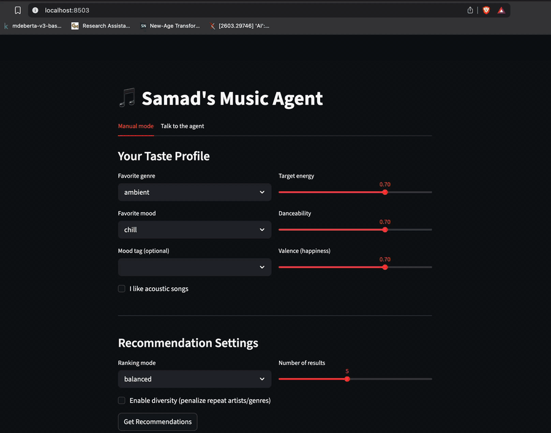

# Music Recommender with an Agent on Top

My final project for the Codepath Applied AI module. I took my Music Recommender from earlier modules and put an AI agent on top of it that takes natural language requests and picks songs from the catalog.

## Demo



## Original project 

The base project is the **Music Recommender Simulation**. You give it a taste profile (genre, mood, energy, etc.) and it scores 20 songs from a CSV catalog, returning the top matches with a short explanation per pick. It also has multiple ranking modes and a diversity penalty.

## What I added

An agent layer using OpenAI `gpt-4o-mini` with tool calling. For every request the agent:

1. Reads the natural language message and pulls out preferences and hard constraints (like "no acoustic").
2. Calls `recommend_songs` as a tool.
3. Calls `validate_results` to check the picks against what was asked.
4. Retries up to 2 times if validation fails, then writes a final answer.

Plus an evaluation harness, structured logging of every step, and a chat UI with playable YouTube embeds per pick.

## Architecture


## Setup

```bash
python -m venv .venv
source .venv/bin/activate
pip install -r requirements.txt
cp .env.example .env  # add your OPENAI_API_KEY (and YOUTUBE_API_KEY for inline playback)
```

## How to run

```bash
python -m src.main                                          # original demo profiles
python -m src.main --agent "chill study music, no acoustic" # agent from CLI
streamlit run app.py                                        # full UI with agent tab
pytest                                                      # tests
python -m scripts.eval                                      # evaluation harness
```

## Sample agent interactions

**1. Pop workout music** — `I want pop workout music, high energy`
Picks: Late Night Flex, Gym Hero, Storm Runner, Bassline Fury, Iron Tide. Validation passed first try.

**2. Chill, no acoustic** — `chill music but no acoustic stuff`
Most chill songs in my catalog are acoustic. The agent retried twice, hit its retry budget, and wrote an answer that admitted the catalog limit. This is exactly why the budget exists.

**3. Lofi study music** — `give me lofi study music`
Picked Library Rain, Midnight Coding, Spacewalk Thoughts. Validation passed.

## Design decisions

- **Agent instead of RAG.** I already had a scorer. The agent gave me natural language input and a planning loop without rewriting any of the scoring math.
- **Validation as its own tool.** Putting the check inside the recommender would just be a filter. As a separate tool the agent has to reason about whether the output answers the question.
- **Retry budget of 2.** First version looped forever. A small budget plus a "best effort" mode lets it give up gracefully.
- **Hard filter for acoustic.** The original recommender only adds a bonus for liking acoustic. It doesn't penalize acoustic when the user says no. I added a hard `exclude_acoustic` filter applied after scoring.

## Testing summary

- 10 pytest tests on the rule-based recommender pass.
- `scripts/eval.py` runs 8 natural language cases. Last run: 5/8 passed, average confidence 0.89. The fails were catalog issues, not agent bugs.

## Reflection

Biggest lesson: the agent is only as good as the data underneath. The agent code worked. Most fails came from the catalog being small and unbalanced. The validation tool was the surprise — same model, same prompt, very different output once the agent had to check its own work.

## Limits and risks

- Catalog is only 20 songs.
- Depends on OpenAI's API. Friendly error if it fails.
- No defense against prompt injection.

See [model_card.md](model_card.md) for the full reflection on bias, misuse, and AI collaboration.
